# 🧩 Classroom Schedule Display — Complete UML & ERD Documentation

This document contains all the core **system design diagrams** for the Classroom Schedule Display Project — built using **Mermaid syntax** for full GitHub Markdown support.

Each section represents a distinct phase of system design:
| Diagram | Focus | Purpose |
|----------|--------|----------|
| **[ERD](#-1-entity-relationship-diagram-erd)** | Data relationships | Database design and structure |
| **[Class Diagram](#-2-class-diagram-uml)** | System structure | Object-oriented logic mapping |
| **[Activity Diagram](#-3-activity-diagram-flowchart)** | Process flow | User journey and system actions |
| **[UI/UX Diagram](#-4-uiux-diagram)** | User interface | User interaction and experience |
| **[Sequence Diagram](#-5-sequence-diagram)** | Interaction over time | Message flow between objects |
| **[Gitflow Diagram](#-6-gitflow-diagram)** | Development workflow | Branching strategy and collaboration |
---

## 🗄️ System Design Diagrams

### 🧱 1. Entity-Relationship Diagram (ERD)
The ERD outlines the core entities and their relationships for managing classroom reservations. Helpful for database schema design and understanding data flow between components for backend development.

**Explanation:**
- Every entity includes a unique ID for relational integrity.
- **Host** Represents users who create/manage reservations.
- **Room** Contains details about each classroom.
- **Event** Holds information about scheduled activities.
- **Reservation** Links hosts, rooms, and events together.
- **Cardinality**:
  - **ROOM** can exist without a reservation (0..*), but each reservation requires exactly one room.
  - **EVENT** and **HOST** follow a similar one-to-many structure with reservations.
  - Each **Reservation** requires one host, one room, and one event.

---

### 🧱 2. Class Diagram (UML)
The class diagram represents the object-oriented structure of the classroom reservation system. Also useful for database design and backend logic implementation.

**Explanation:**
- Classes mirror ERD entities but include **behavior (methods)** for application logic.
- Each reservation links to one room, host, and event.
- Ideal for backend OOP frameworks (Flask, Django, .NET, etc.).

---

### 🔁 3. Activity Diagram (Flowchart)
The activity diagram illustrates the workflow for making a classroom reservation. It captures user actions and system decisions. Useful for frontend development and backend developers to understand user interactions.

**Explanation:**
- Represents the main activities and decision points in the reservation process.

---

### 🌀 4. UI/UX Diagram
The UI/UX diagram provides a high-level overview of the user interface for the classroom display system. It focuses on key screens and user interactions to enhance user experience.

```mermaid
---
title: Classroom Display UI/UX Diagram
config:
    theme: forest  
---
flowchart TD
    A[🏫 Classroom Display Dashboard]
    A --> B[🆕 Make Reservation]
    A --> C[📅 View Schedule]

```

**Explanation:**
- Focuses on primary user actions: making reservations and viewing schedules.
- Useful for frontend developers and UI/UX designers to create intuitive interfaces.

---

### ⏳ 5. Sequence Diagram
The sequence diagram details the interaction flow for a user making a classroom reservation. It captures the message exchanges between the user, frontend, backend, and database.

**Explanation:**
- Captures the step-by-step interaction for making a reservation.
- Helps both frontend and backend developers understand the flow of data and control.

### 🌿 6. Gitflow Diagram
Using Gitflow branching diagram to help visualize the development workflow for the Classroom Schedule Display project.

**Explanation:**
- Visualizes the Gitflow branching strategy for collaborative development.
- Highlights feature branches for frontend, backend, database, and DevOps tasks.

> 🦬 *BuffTeks Development Team — Designing clarity, structure, and flow for every classroom.*
